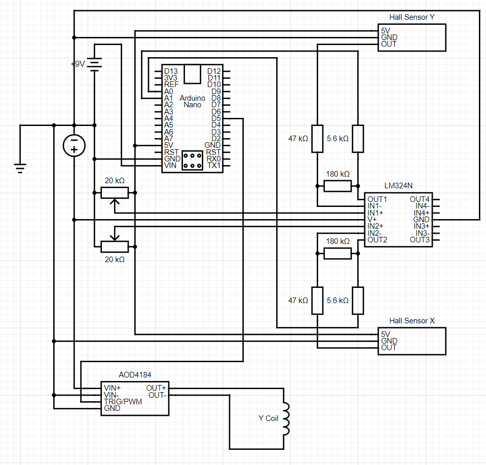

# maglev
Magnetic Levitation Arduino project


## Hall sensor routing
[How to Use a Hall Effect Sensor With Arduino](https://maker.pro/arduino/tutorial/how-to-use-a-hall-effect-sensor-with-arduino)
>Furthermore, a 10K resistor is connected between the VCC and Vout pins of the Hall effect sensor. This is done to pull the output of the Hall effect sensor to 5V. The connections are done as shown below (the side with the printed number is facing toward you in the diagram):


## Troubleshooting AOD4184
With the previous driver (L298N) leading to an incredible current draw from my Arduino Nano, and visibly frying the IC on it, we have purchased a new driver AOD4184. This driver is a relatively simple MOSFET switching circuit that allows for PWM controlling of current output from a DC source. 

By hooking up a joystick to the hallXPIN, I managed to create a PWM signal with variable duty cycle controlled by the control stick.
https://www.codrey.com/electronics/dual-mosfet-switch-module/



I forgot Flyby Resistor


```
// set pin numbers for switch, joystick axes, and LED:
#define hallXPIN A0
#define hallYPIN A1
#define buttonPIN 2

#define enableAPIN 5
#define in1PIN 10
#define in2PIN 9
#define in3PIN 8
#define in4PIN 7
#define enableBPIN 6

const int refreshTime = 50; // [ms]
const int range = 512;

int valX = 0;
int valY = 0;
int mappedX;
int mappedY;

bool button = false;

void setup() {
  Serial.begin(115200);
  pinMode(enableAPIN,OUTPUT);
  pinMode(in1PIN,OUTPUT);
  pinMode(in2PIN,OUTPUT);
  pinMode(in3PIN,OUTPUT);
  pinMode(in4PIN,OUTPUT);
  pinMode(enableBPIN,OUTPUT);

  // Initial direction magnets
  digitalWrite(in1PIN, LOW);
  digitalWrite(in2PIN, HIGH);

  digitalWrite(in3PIN, LOW);
  digitalWrite(in4PIN, HIGH);
  
}

//Measure RPM
void loop() {
  valX = analogRead(hallXPIN);
  valY = analogRead(hallYPIN);

  // map the reading from the analog input range to the output range:
  mappedX = map(valX, 0, 1023, 0, 255);
  // map the reading from the analog input range to the output range:
  mappedY = map(valY, 0, 1023, 0, 255);

//  button = digitalRead(buttonPIN);

//  Serial.print(button);

  Serial.print("\nHall sensor Data,\tX: ");
  Serial.print(valX);
  Serial.print("\tMapped value: ");
  Serial.print(mappedX);
//  Serial.print("\tY: ");
//  Serial.println(mappedY);

  analogWrite(enableAPIN, mappedX);
//  analogWrite(enableBPIN, mappedY);

//  if (button) {
//    analogWrite(enableAPIN, 255);
//    analogWrite(enableBPIN, 255);
//  } else {
//    analogWrite(enableAPIN, 0);
//    analogWrite(enableBPIN, 0);
//  }


  delay(refreshTime);
}
``` 


When 